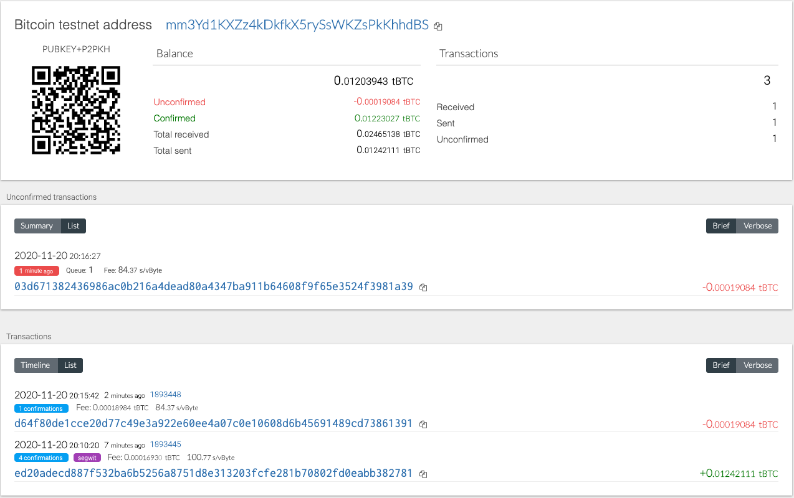
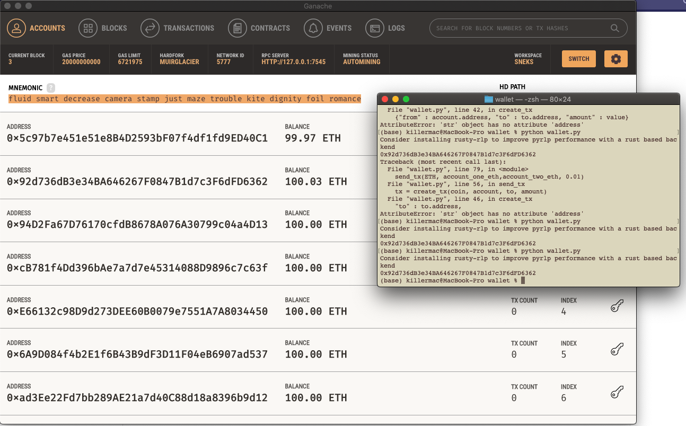

# Blockchain and Python
## Managing Multiple Blockchain Currencies with Python
Using HD-Wallet-Derive, I built a multi-coin wallet for managing multiple cryptocurrencies with Python/VSCode

## Tools Used
- HD-Wallet-Derive
    - Installed via clone of this [repo](https://github.com/dan-da/hd-wallet-derive)
- PHP (Installed but use of PHP not foundational)
- web3.py (Python Ethereum Library)
    - Cloned from this [repo](https://github.com/ethereum/web3.py)
- bit (Python Bitcoin Library)
    - Installed via this [link](https://ofek.dev/bit/)

## Test Transactions
### Bitcoin Testnet

### Ethereum Testnet

